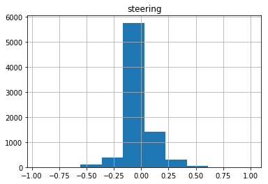
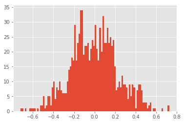

## Project: Self-driving car project, behavior cloning for driving. 

1.Task Goal:
The main task is to drive a car around in a simulator on a race track, and then use deep learning to mimic the behavior of human drving.
We had to train a car to drive itself in a video game. The car was trained to drive itself using a deep neural network.
The input here is an image and the output should be control commands such as Steering Angle. Here for simplicity we just predict steering angle.


---
2.The input data source:
1）first i collected data image and steeing angle csv data from driving simulator by myself. but when i play the game, i found that i controll the car unsmoothly because of the driving skills and my slow laptop and keyboard.
2)so i decided to use the data provided by udacity to focus on the model selection and training.


3.Data Visualization

Always the first step to train a model for an specific dataset is visualizing the dataset itself. That will give us the intuition to preprocess data and select model next.

1)Input Images Obersavation :
    from the input image sample, we can see that:

a).The bonnet of the car is visible at the bottom of the image.we can cut the part of bottom with little infulunce on road detection.
b).there are sky part on the upper part which is also no use for road detecion .
    Only the edges of the road are relevant for determing the steering angle.
    The portion of the image above the horizon (where the road ends) can be cutted in the image pre-processing.
c). sometimes the road edges is not very clear,maybe we should add more cv image processing
    

---

2): driving_log.csv Summary & Exploration

Complete the basic data summary below.


```python
import pandas as pd
import numpy as np
#print("dataframe shape ",drivingLog.shape)
#print(drivingLog.ix[0])


data = pd.read_csv('./data/data/driving_log.csv', usecols=["steering","throttle","brake","speed"])
data.describe(np.arange(0,1,.1),include='all')
#drivingLog.loc[:,["Steering"]].describe(np.arange(0,1,.1),include='all')




4. Data Preprocess Attemption: recreate data to balance it 
from the data histgram ,we can see 60%-70%  of original data's steering angle is near 0.
（to balance data and to reserve the original infomation, a good solution is augmented the other part of data 6 times as the number of  0 steering angle data.）

it is hard to load all the image into memery,so here keras generator is used.
the following preprocessings are included:
1)train data steering angles are selected to a normal-like distribution.
2)cut the upper 20% of image and the bottom 20 pixels
3)resize the image to 200*66 or  64*32 
4)randomly flip the image to get balanced left turn and right turn data 
5）use the left and right camera data with an offset of +-0.25 steering angle
5)using hsv image transformation


```python
#image preprocessing and transformation

import math
col,row=320,160
#new_size_col,new_size_row = 64, 32
new_size_col,new_size_row = 200, 66
def augment_brightness_camera_images(image):
    image1 = cv2.cvtColor(image,cv2.COLOR_RGB2HSV)
    random_bright = .25+np.random.uniform()
    image1[:,:,2] = image1[:,:,2]*random_bright
    #image1 = cv2.cvtColor(image1,cv2.COLOR_HSV2RGB)
    return image1

def trans_image(image,steer,trans_range):
    # Translation
    tr_x = trans_range*np.random.uniform()-trans_range/2
    steer_ang = steer + tr_x/trans_range*0.4
    tr_y = 40*np.random.uniform()-40/2
    Trans_M = np.float32([[1,0,tr_x],[0,1,tr_y]])
    image_tr = cv2.warpAffine(image,Trans_M,(col,row))
    return image_tr,steer_ang

def add_random_shadow(image):
    top_y = 320*np.random.uniform()
    top_x = 0
    bot_x = 160
    bot_y = 320*np.random.uniform()
    image_hls = cv2.cvtColor(image,cv2.COLOR_RGB2HLS)
    shadow_mask = 0*image_hls[:,:,1]
    X_m = np.mgrid[0:image.shape[0],0:image.shape[1]][0]
    Y_m = np.mgrid[0:image.shape[0],0:image.shape[1]][1]
    shadow_mask[((X_m-top_x)*(bot_y-top_y) -(bot_x - top_x)*(Y_m-top_y) >=0)]=1
    #random_bright = .25+.7*np.random.uniform()
    if np.random.randint(2)==1:
        random_bright = .5
        cond1 = shadow_mask==1
        cond0 = shadow_mask==0
        if np.random.randint(2)==1:
            image_hls[:,:,1][cond1] = image_hls[:,:,1][cond1]*random_bright
        else:
            image_hls[:,:,1][cond0] = image_hls[:,:,1][cond0]*random_bright    
    image = cv2.cvtColor(image_hls,cv2.COLOR_HLS2RGB)
    return image


def preprocessImage(image):
    shape = image.shape
    # note: numpy arrays are (row, col)!
    image = image[math.floor(shape[0]/5):shape[0]-20, 0:shape[1]]
    image = cv2.resize(image,(new_size_col,new_size_row),interpolation=cv2.INTER_AREA)    
    return image

def preprocess_image_random(line_data):
    i_lrc = np.random.randint(4)
    if (i_lrc <= 1):
        path_file = log_directory+line_data[0].strip()
        shift_ang = 0
    if (i_lrc == 2):
        path_file = log_directory+line_data[1].strip()
        shift_ang = 0.25
    if (i_lrc == 3):
        path_file = log_directory+line_data[2].strip()
        shift_ang = -.25
    y_steer = float(line_data[3].strip()) + shift_ang
    #image = cv2.imread(path_file)
    #image = cv2.cvtColor(image,cv2.COLOR_BGR2RGB)
    image = plt.imread(path_file)
    image,y_steer = trans_image(image,y_steer,50)
    image = augment_brightness_camera_images(image)
    image = preprocessImage(image)
    #image=add_random_shadow(image)
    image = np.array(image)
    
    ind_flip = np.random.randint(2)
    if ind_flip==0:
        image = cv2.flip(image,1)
        y_steer = -y_steer
    #image = image.astype(np.float32)
    #image = image/255.0 - 0.5
    return image,y_steer
```


```python
# define the trainging data generator and validation data generator

def generateBatch(logs,batch_size = 32,threshhold=0.5):
    rounder_factor=1
    batch_images = np.zeros((batch_size, new_size_row, new_size_col, 3))
    batch_steering = np.zeros(batch_size)
    while 1:
        for i_batch in range(batch_size):
            i_line = np.random.randint(len(logs))
            line_data = logs[i_line]
            x,y = preprocess_image_random(line_data)
                       
            if abs(y)>0.4 and (i_batch+9)<batch_size:
                for j in range(10):
                    batch_images[i_batch] = x
                    batch_steering[i_batch] = y
                    i_batch=i_batch+1
            else:        
                batch_images[i_batch] = x
                batch_steering[i_batch] = y
        yield batch_images, batch_steering
        
        

def generateBatchVal(val_logs,batch_size = 32):
    batch_images = np.zeros((batch_size, new_size_row, new_size_col, 3))
    batch_steering = np.zeros(batch_size)
    
    startIdx = 0
    batchCount = len(val_logs)/batch_size 
    while True: 
        endIdx = startIdx + batch_size

        for i in range(batch_size):
            #img_path=val_data_directory+val_logs[startIdx+i][0].split("D:\\selfdriving\\behavior cloning video and project\\simulator-windows-64\\IMG\\")[1].strip()
            #i_line = np.random.randint(len(val_logs))
            i_line=startIdx+i
            line_data = val_logs[i_line]
            path_file = log_directory+line_data[0].strip()
            img = plt.imread(path_file)
            x=preprocessImage(img)
            y=float(line_data[3])
            batch_images[i] = x
            batch_steering[i] = y
        yield batch_images, batch_steering
        startIdx = endIdx
        if len(val_logs)-startIdx <batch_size:
            startIdx = len(val_logs)-batch_size-1
```


```python
# visualize the generateBatch steering distribution, we can see the input data distribution is normal-like,and most data range from(-0.25,0.25)
batch_generator=generateBatch(logs,batch_size = 250)
batch_steering=get_steeringList(batch_generator,size=5)   
plt.hist(batch_steering.astype('float'),bins=100)
```





----

5: Design and Test a Model Architecture

1)first using the nvida paper model
2) then i create 3 different models from scrath. with less image resolution and fewer layers


```python
# model design
import pickle
import numpy as np
import math
from keras.utils import np_utils
from keras.layers import Conv2D, Flatten, Lambda
from keras.layers.pooling import MaxPooling2D
from keras.layers.core import Dropout, Dense, Activation
from keras.optimizers import SGD, Adam
from keras.models import Sequential
from keras.regularizers import l2

model = Sequential()


def build_model1(model):    #input shape (33,100,3)
    reg_val=0.0001
    inputShape = (66,200,3)
     # select elu because output can be less than zero 
    model.add(Lambda(lambda x: x/255.-0.5,input_shape=inputShape,output_shape=inputShape,name="Normalization"))
    model.add(Conv2D(24,5,5,subsample=(2,2), activation = 'elu', border_mode='valid',W_regularizer=l2(reg_val),name='Conv2D1')) 
    model.add(Dropout(0.5, name='DropoutC1'))
    #output shape 31*98*24*3

    model.add(Conv2D(36,5,5,subsample=(2,2), activation = 'elu',  border_mode='valid',name='Conv2D2'))
    model.add(Dropout(0.3, name='DropoutC2'))
    #output shape 14*47*36*3

    model.add(Conv2D(48,5,5,subsample=(2,2), activation = 'elu', border_mode='valid', name='Conv2D3'))
    model.add(Dropout(0.3, name='DropoutC3'))
    #output shape 5*22*48*3

    model.add(Conv2D(64,3,3,subsample=(1,1), activation = 'elu', border_mode='valid', name='Conv2D4'))
    model.add(Dropout(0.3, name='DropoutC4'))
    #output shape 3*20*64*3

    model.add(Conv2D(64,3,3,subsample=(1,1), activation = 'elu', border_mode='valid', name='Conv2D5'))
    model.add(Dropout(0.3, name='DropoutC5'))
    #output shape 1*18*64*3

    # convolution to dense,flatten layer  1152 nodes
    model.add(Flatten(name='flatten'))

    model.add(Dense(100,activation='elu', name='Dense1'))
    model.add(Dropout(0.5, name='DropoutD1'))

    model.add(Dense(50,activation='elu', name='Dense2'))
    model.add(Dropout(0.5, name='DropoutD2'))

    model.add(Dense(10,activation='elu', name='Dense3'))
    model.add(Dropout(0.5, name='DropoutD3'))

    model.add(Dense(1,activation='elu', name='Output')) # problem is a regression

    model.summary()
    
build_model1(model)


```

    Using TensorFlow backend.
    

    ____________________________________________________________________________________________________
    Layer (type)                     Output Shape          Param #     Connected to                     
    ====================================================================================================
    Normalization (Lambda)           (None, 66, 200, 3)    0           lambda_input_1[0][0]             
    ____________________________________________________________________________________________________
    Conv2D1 (Convolution2D)          (None, 31, 98, 24)    1824        Normalization[0][0]              
    ____________________________________________________________________________________________________
    DropoutC1 (Dropout)              (None, 31, 98, 24)    0           Conv2D1[0][0]                    
    ____________________________________________________________________________________________________
    Conv2D2 (Convolution2D)          (None, 14, 47, 36)    21636       DropoutC1[0][0]                  
    ____________________________________________________________________________________________________
    DropoutC2 (Dropout)              (None, 14, 47, 36)    0           Conv2D2[0][0]                    
    ____________________________________________________________________________________________________
    Conv2D3 (Convolution2D)          (None, 5, 22, 48)     43248       DropoutC2[0][0]                  
    ____________________________________________________________________________________________________
    DropoutC3 (Dropout)              (None, 5, 22, 48)     0           Conv2D3[0][0]                    
    ____________________________________________________________________________________________________
    Conv2D4 (Convolution2D)          (None, 3, 20, 64)     27712       DropoutC3[0][0]                  
    ____________________________________________________________________________________________________
    DropoutC4 (Dropout)              (None, 3, 20, 64)     0           Conv2D4[0][0]                    
    ____________________________________________________________________________________________________
    Conv2D5 (Convolution2D)          (None, 1, 18, 64)     36928       DropoutC4[0][0]                  
    ____________________________________________________________________________________________________
    DropoutC5 (Dropout)              (None, 1, 18, 64)     0           Conv2D5[0][0]                    
    ____________________________________________________________________________________________________
    flatten (Flatten)                (None, 1152)          0           DropoutC5[0][0]                  
    ____________________________________________________________________________________________________
    Dense1 (Dense)                   (None, 100)           115300      flatten[0][0]                    
    ____________________________________________________________________________________________________
    DropoutD1 (Dropout)              (None, 100)           0           Dense1[0][0]                     
    ____________________________________________________________________________________________________
    Dense2 (Dense)                   (None, 50)            5050        DropoutD1[0][0]                  
    ____________________________________________________________________________________________________
    DropoutD2 (Dropout)              (None, 50)            0           Dense2[0][0]                     
    ____________________________________________________________________________________________________
    Dense3 (Dense)                   (None, 10)            510         DropoutD2[0][0]                  
    ____________________________________________________________________________________________________
    DropoutD3 (Dropout)              (None, 10)            0           Dense3[0][0]                     
    ____________________________________________________________________________________________________
    Output (Dense)                   (None, 1)             11          DropoutD3[0][0]                  
    ====================================================================================================
    Total params: 252,219
    Trainable params: 252,219
    Non-trainable params: 0
    ____________________________________________________________________________________________________
    


```python
# model design
import pickle
import numpy as np
import math
from keras.utils import np_utils
from keras.layers import Conv2D, Flatten, Lambda
from keras.layers.pooling import MaxPooling2D
from keras.layers.core import Dropout, Dense, Activation
from keras.optimizers import SGD, Adam
from keras.models import Sequential

def build_model2(model):    #input shape (32,64,3)

    inputShape = (32,64,3)
     # select elu because output can be less than zero 
    model.add(Lambda(lambda x: x/255.-0.5,input_shape=inputShape,output_shape=inputShape,name="Normalization"))
    model.add(Conv2D(32,3,3, activation = 'elu', border_mode='valid',name='Conv2D1')) #(30,62,32,3)
    model.add(MaxPooling2D(pool_size=(2,2), name='MaxPool1'))
    model.add(Dropout(0.3, name='DropoutC1'))
    #output shape 15*31*32*3

    model.add(Conv2D(64,3,3, activation = 'elu',  border_mode='valid',name='Conv2D2')) #(13,29,64,3)
    model.add(MaxPooling2D(pool_size=(2,2), name='MaxPool2'))
    model.add(Dropout(0.3, name='DropoutC2'))
    #output shape 6*14*32*3

    model.add(Conv2D(128,3,3, activation = 'elu', border_mode='valid', name='Conv2D3')) #(4,12,128,3)
    model.add(MaxPooling2D(pool_size=(2,2), name='MaxPool3'))
    model.add(Dropout(0.3, name='DropoutC3'))
    #output shape 2*6*128*3=4608

    model.add(Conv2D(128,2,2,activation = 'elu', border_mode='valid', name='Conv2D4')) #(1,3,256,3)
    model.add(Dropout(0.3, name='DropoutC4'))
    #output shape 1*3*256*3=2304

    # convolution to dense,flatten layer 2304 nodes
    model.add(Flatten(name='flatten'))

    model.add(Dense(100,activation='elu', name='Dense1'))
    model.add(Dropout(0.5, name='DropoutD1'))

    model.add(Dense(50,activation='elu', name='Dense2'))
    model.add(Dropout(0.5, name='DropoutD2'))

    model.add(Dense(10,activation='elu', name='Dense3'))
    model.add(Dropout(0.5, name='DropoutD3'))

    model.add(Dense(1,activation='elu', name='Output')) # problem is a regression

    model.summary()
    
#build_model2(model)


```


```python
import pickle
import numpy as np
import math
from keras.utils import np_utils
from keras.layers import Conv2D, Flatten, Lambda
from keras.layers.pooling import MaxPooling2D
from keras.layers.core import Dropout, Dense, Activation
from keras.optimizers import SGD, Adam
from keras.models import Sequential
def build_model3(model):    #input shape (32,64,3)

    inputShape = (32,64,3)
     # select elu because output can be less than zero 
    model.add(Lambda(lambda x: x/255.-0.5,input_shape=inputShape,output_shape=inputShape,name="Normalization"))
    model.add(Conv2D(32,5,5, activation = 'elu', border_mode='valid',name='Conv2D1')) #(28,60,32,3)
    model.add(MaxPooling2D(pool_size=(4,4), name='MaxPool1'))
    model.add(Dropout(0.3, name='DropoutC1'))
    #output shape 7*15*32*3

    model.add(Conv2D(64,3,3, activation = 'elu',  border_mode='valid',name='Conv2D2')) #(2,5,64,3)
    model.add(MaxPooling2D(pool_size=(2,2), name='MaxPool2'))
    model.add(Dropout(0.3, name='DropoutC2'))
    #output shape 1*2*64*3

    # convolution to dense,flatten layer 384 nodes
    model.add(Flatten(name='flatten'))

    model.add(Dense(64,activation='elu', name='Dense1'))
    model.add(Dropout(0.5, name='DropoutD1'))

    model.add(Dense(1,activation='elu', name='Output')) # problem is a regression

    model.summary()
    
#build_model3(model)


```


```python
def build_model4(model):    #input shape (32,64,3)
    reg_val=0.0001
    inputShape = (32,64,3)
     # select elu because output can be less than zero 
    model.add(Lambda(lambda x: x/255.-0.5,input_shape=inputShape,output_shape=inputShape,name="Normalization"))
    model.add(Conv2D(32,5,5, activation = 'elu', border_mode='valid',W_regularizer=l2(reg_val),name='Conv2D1')) #(28,60,32,3)
    model.add(MaxPooling2D(pool_size=(4,4), name='MaxPool1'))
    model.add(Dropout(0.5, name='DropoutC1'))
    #output shape 7*15*32*3

    model.add(Conv2D(16,3,3, activation = 'elu',  border_mode='valid',name='Conv2D2')) #(2,5,64,3)
    model.add(MaxPooling2D(pool_size=(2,2), name='MaxPool2'))
    model.add(Dropout(0.5, name='DropoutC2'))
    #output shape 1*2*16*3

    # convolution to dense,flatten layer 384 nodes
    model.add(Flatten(name='flatten'))

    model.add(Dense(10,activation='elu', name='Dense1'))
    model.add(Dropout(0.5, name='DropoutD1'))

    model.add(Dense(1,activation='elu', name='Output')) # problem is a regression

    model.summary()
    
#build_model4(model)
```


```python
# choose optimizer and regression loss funtion
#adam = Adam(lr=1e-4)
#model.compile(loss='mse',optimizer=adam)
model.compile(optimizer="adam", loss="mse")

```


```python
6. Model training:
    1)first i trained the model on my laptop, it was really frustrating with near 1 hour for each epoch.
    2)after that ,i used the aws to save time at 4 minutes for each epoch. 
    3)but to tune the hyperparameter well, it really took some working days with a increasing AWS charing bill.
    
```


```python
def predict_test(i,steering_angle):
        
        path_file = log_directory+logs[i][0].strip()
        image = plt.imread(path_file)
        image_array = np.asarray(image)
        image_array=preprocessImage(image_array)
        transformed_image_array = image_array[None, :, :, :]
        predicted_steering_angle = float(model.predict(transformed_image_array, batch_size=1))
        print(" logs in row ",i," steering_angle is ",steering_angle," predicted_steering_angle is ",predicted_steering_angle)


from keras.callbacks import ModelCheckpoint, ReduceLROnPlateau, LambdaCallback, Callback
import json

numTimes = 10
numEpoch = 1

for time in range(numTimes):
    trainGenerator = generateBatch(logs,250)
    validGenerator = generateBatchVal(logs,250)
    samplesPerEpoch = 10000 
    nbValSamples = 8250
    history = model.fit_generator(trainGenerator, samples_per_epoch=samplesPerEpoch, nb_epoch=numEpoch, validation_data=validGenerator,
                   nb_val_samples=nbValSamples, callbacks=[ModelCheckpoint(filepath="weights"+str(time)+".h5", verbose=1, save_best_only=True)])
    print("the epoch",time)
    for k in range(30):
        steering_angle=0
        while(abs(steering_angle)<0.5):
            i = np.random.randint(len(logs))
            steering_angle=float(logs[i][3].strip())
        predict_test(i,steering_angle)    

```


```python
7.Result check:
    1)in every epoch ,i will check the validation loss value , which goes down first and then rise up. when the validation loss goes up, 
    it means the model training begins to overfit. we can stop the training nearby.
    2)for every epoch ,i will randomly select some record with steering angle greater than 0.5, and compare it with the prediction 
    using the model in this epoch
    3)the most important check,drive the model and weights in the simulator to see how it works
    
    finally select the model weights with the best performance.
```


```python
# load the model
from keras.models import model_from_json
jsonFile = './model.json'
with open(jsonFile, 'r') as jfile:
    #model = model_from_json(json.load(jfile))
    model = model_from_json(jfile.read())
model.compile("adam", "mse")
weights_file = jsonFile.replace('json', 'h5')
model.load_weights(weights_file)
```


```python
8 .Result
	after training the model, i got the model weights  model.h5 .runing it in the simulator by  python drive.py model.json
	the car can selfdive smoothly in the track 1 for a whole round.

9.Conclution and reflection:
    1)the data visualisation step  is really important. we should spend more time on it before start to manipulate data
    2)it maybe better to start from a simple model to see what happens. and better to compare the predciton steering and orginal steering 
    before train all and  run on the simulatior
    3)i tried four different model,it seems that little model can  work too. in my idea, this project works in a simulated game environment which simplizes many input data.if we use little
	model in real world environment,that maybe lead to underfitting problems.
	4)in real driving ,only images as input is not sufficient.i think that adding line detecting,control policy like pid control  will improve the performance .i will try later.
	5)the tuning part is time-consuming .i think maybe we can build an autonomous tuing framework  so that let the human 
    do some intuition and creative things while let the machine do what it is good at.
```
